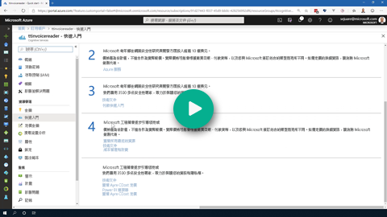
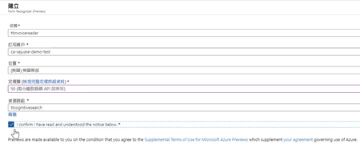
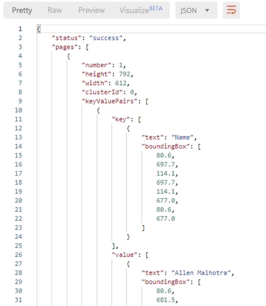

## <a name="demo-2---using-form-recognizer"></a>示範 2 - 使用表單辨識器

[](https://globaleventcdn.blob.core.windows.net/assets/aiml/aiml10/videos/Demo2.mp4 "示範 2")

## <a name="summary"></a>摘要
在本練習中，我們會了解如何使用表單辨識器服務。 假設已建立儲存體帳戶 (如[第一個示範](demo1.md)中所述)。


## <a name="what-you-need"></a>必要條件
- [發票訓練集](https://globaleventcdn.blob.core.windows.net/assets/aiml/aiml10/data/training.zip)

- 存取有限存取的預覽。 為存取預覽，請填寫並提交 [Form Recognizer access request](https://aka.ms/FormRecognizerRequestAccess) (表單辨識器存取要求) 表單。

- [Postman](https://www.getpostman.com/) 用於將要求傳送至表單識別器服務 REST API。 若要深入了解，請參閱此[簡短入門](postman.md)。

- Postman 表單辨識器要求[集合](src/Collections/Form_Recognizer.postman_collection.json)。

## <a name="azure-resources"></a>Azure 資源
我們在本示範中使用的唯一資源是表單辨識器服務。


| 名稱                       | 類型                            | 目的                    |
| -------------------------- | ------------------------------- | ------------------------- |
| **ttinvoicereader**       | 表單辨識器服務         | 這項服務最後會併入全功能服務。 但現在屬於有限存取的預覽。 為存取預覽，請填寫並提交 [Form Recognizer access request](https://aka.ms/FormRecognizerRequestAccess) (表單辨識器存取要求) 表單。  |


## <a name="what-to-do"></a>應採取的動作

有三個主要步驟：
1. 將訓練資料上傳至儲存體帳戶
2. 建立表單辨識器服務
3. 訓練並使用表單辨識器服務

### <a name="upload-training-data"></a>上傳訓練資料


1. 在上一個示範所建立的儲存體帳戶中，建立稱為 `train` 的容器。

[](https://docs.microsoft.com/en-us/azure/storage/blobs/storage-quickstart-blobs-portal?WT.mc_id=msignitethetour2019-github-aiml10 "建立容器")

2. 下載並解壓縮[發票訓練集](https://globaleventcdn.blob.core.windows.net/assets/aiml/aiml10/data/training.zip)。

3. 將解壓縮的[發票訓練集](https://globaleventcdn.blob.core.windows.net/assets/aiml/aiml10/data/training.zip)上傳至 `train` 容器。 這可以直接使用[入口網站](https://docs.microsoft.com/en-us/azure/storage/blobs/storage-quickstart-blobs-portal?WT.mc_id=msignitethetour2019-github-aiml10#upload-a-block-blob)，或使用 [Azure 儲存體總管](https://docs.microsoft.com/en-us/azure/vs-azure-tools-storage-explorer-blobs?WT.mc_id=msignitethetour2019-github-aiml10)來完成 (如[影片](https://globaleventcdn.blob.core.windows.net/assets/aiml/aiml10/videos/Demo2.mp4 "示範 1")中所示)。

### <a name="create-form-recognizer-service"></a>建立表單辨識器服務

若要這麼做，您必須具有表單辨識器預覽的存取權。 若要存取預覽，請填寫並提交 [Form Recognizer access request](https://aka.ms/FormRecognizerRequestAccess) (表單辨識器存取要求) 表單。 


[](https://docs.microsoft.com/en-us/azure/cognitive-services/form-recognizer/overview?WT.mc_id=msignitethetour2019-github-aiml10#request-access "表單辨識器")

### <a name="train-the-form-recognizer-service"></a>訓練表單辨識器服務

本節使用 Postman，並假設您知道如何載入集合、處理變數，以及設定預先要求指令碼。 為了解如何執行這些特定操作，我們已包含一些[指示](postman.md)。

下表列出在本節練習中設定的變數：

| 名稱                       | 類型                            | 目的                    |
| -------------------------- | ------------------------------- | ------------------------- |
| `Ocp-Apim-Subscription-Key`       | 授權         | 取得表單辨識器服務存取權的金鑰  |
| `endpoint`       | 變數         | 指定表單辨識器端點  |
| `modelId`       | 變數         | 目前的表單辨識器模型 (在步驟 5 中設定)  |

1. 將[表單辨識器集合](src/Collections/Form_Recognizer.postman_collection.json)載入至Postman。

2. 將 `Ocp-Apim-Subscription-Key` 授權標頭及 `endpoint` 變數設成表單辨識器服務 (二者皆位於入口網站)。

3. 開啟 `TrainModel` 要求，然後變更預先要求指令碼，將 `storageAccount` 變數設成儲存體帳戶 (影片中的變數是 `ttinvoicestorage`)，並將 `SASValue` 設成適用於 `train` 容器的適當安全存取簽章。 若要了解如何取得安全存取簽章，請參閱我們的[簡短說明](sas.md)。

```javascript
pm.environment.set('storageAccount', '<YOUR STORAGE ACCOUNT>')
pm.environment.set('container', 'train')
pm.environment.set('SASValue', '<SAS>')
```

4. 按下要求上的 [傳送]。 您的回應看起來會如下：


5. 將集合的 `modelId` 變數設成上文傳回的 `modelId`。


### <a name="use-the-form-recognizer-service"></a>使用表單辨識器服務

1. 開啟 `AnalyzeForm` 要求。 在 [主體]  區段中，按一下 `Select Files` 按鈕，選擇之前下載的發票。 傳送要求之後，您應該會收到類似以下的內容：



# <a name="next-demo"></a>下一個示範
繼續[示範 3 - 建立自訂的發票讀取器技能](demo3.md)，了解如何使用 Azure Functions 建立自訂的發票讀取器技能
