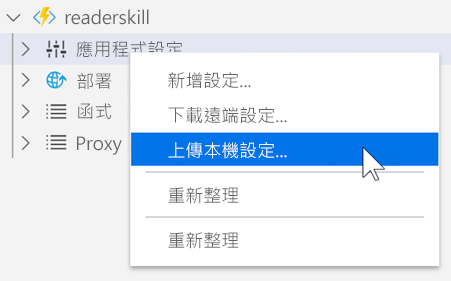

## <a name="demo-3---creating-a-custom-invoice-reader-skill"></a>示範 3 - 建立自訂的發票讀取器技能

[](https://globaleventcdn.blob.core.windows.net/assets/aiml/aiml10/videos/Demo3.mp4 "示範 3")

## <a name="summary"></a>摘要
在本練習中，我們會建立 Azure 函式形式的 Azure 搜尋服務技能，其會從 Azure 搜尋服務取得資料，並傳回代表 PDF 發票內容的結構化 JSON 文件。 若要深入了解如何建立 Azure 函式，請參閱[文件](https://docs.microsoft.com/en-us/azure/azure-functions/functions-create-first-azure-function-azure-cli?WT.mc_id=msignitethetour2019-github-aiml10)。假設已建立儲存體帳戶 (如[第一個示範](demo1.md)以及[第二個示範](demo2.md)所建立的表單辨識器服務中所述)


## <a name="what-you-need"></a>必要條件
- [發票測試集](https://globaleventcdn.blob.core.windows.net/assets/aiml/aiml10/data/test.zip) (用於測試 Azure 函式)


- [Postman](https://www.getpostman.com/) 用於將要求傳送至表單識別器服務 REST API。 若要深入了解，請參閱此[簡短入門](postman.md)。

- Postman 讀取器技能要求[集合](src/Collections/Reader_Skill.postman_collection.json)。

- [Azure Functions Core Tools](https://docs.microsoft.com/en-us/azure/azure-functions/functions-run-local?WT.mc_id=msignitethetour2019-github-aiml10#v2)

## <a name="azure-resources"></a>Azure 資源
下表描述在此練習中建立的所有資源。

| 名稱                       | 類型                            | 目的                    |
| -------------------------- | ------------------------------- | ------------------------- |
| **readerskillstorage**   | 儲存體帳戶              | 用於 Azure 函式的儲存體 |
| **readerskill**          | 函數應用程式                 | 認知技能應用程式 |
| **readerskill**          | App Insights                   | 將見解新增至函數應用程式 |
| **EastUS2LinuxDynamicPlan** | App Service 方案                   | 以耗用量為基礎的函數應用程式執行計畫 (這是以隱含方式建立) |

## <a name="what-to-do"></a>應採取的動作

有三個主要步驟：
1. 在本機執行 `InvoiceReaderSkill` Azure 函式
2. 建立支援 `InvoiceReaderSkill` Azure 函式的資源
3. 在 Azure 上執行 `InvoiceReaderSkill`

### <a name="run-the-azure-function-locally"></a>在本機執行 Azure 函式

1. 在 [Visual Studio Code](https://code.visualstudio.com/) 中下載於此存放庫中找到的 [InvoiceReaderSkill](src/InvoiceReaderSkill) 程式碼 (請確定已安裝 [Azure Tools](https://marketplace.visualstudio.com/items?itemName=ms-vscode.vscode-node-azure-pack))。

2. 將 `local.settings.json` 檔案新增至具有下列內容的資料夾：

```json
{
  "IsEncrypted": false,
  "Values": {
    "FUNCTIONS_WORKER_RUNTIME": "python",
    "AzureWebJobsStorage": "{AzureWebJobsStorage}",
    "FormsRecognizerEndpoint": "<YOUR_FORMS_ENDPOINT>.cognitiveservices.azure.com",
    "FormsRecognizerKey": "<YOUR_FORMS_KEY>",
    "ModelId": "<YOUR_TRAINED_MODEL_ID>"
  }
}
```
3. 執行 `func host start` 命令以啟動函式。

4. 將 Postman 讀取器技能要求[集合](src/Collections/Reader_Skill.postman_collection.json)匯入 Postman

5. 開啟 `Local Forms Skills` 要求，然後變更預先要求指令碼，將 `storageAccount` 變數設成您的儲存體帳戶 (影片中的變數是 `ttinvoicestorage`)，並將 `SASValue` 設成適用於 `train` 容器的適當安全存取簽章。 若要了解如何取得安全存取簽章，請參閱我們的[簡短說明](sas.md)。

```javascript
pm.environment.set('storageAccount', '<YOUR STORAGE ACCOUNT>')
pm.environment.set('container', 'test')
pm.environment.set('SASValue', '<SAS>')
```

6. 驗證 `POST` URI 是否符合 Azure 函式的 URI (我們執行時用的是 `http://localhost:7071/api/AnalyzeInvoice`)，然後按一下 [傳送]。 您應該會看到如下所示的回應：


### <a name="create-azure-function-resources"></a>建立 Azure 函式資源

假設下列命令在與實際函式相同的目錄中執行

1. 執行下列 Azure CLI 命令建立適當的資源，並發佈函式：

建立函式儲存體

```
az storage account create --name {FUNCTION_STORAGE} --location {LOCATION} --resource-group {YOUR_RG} --sku Standard_LRS
```

建立函數應用程式
```
az functionapp create --resource-group {YOUR_RG} --consumption-plan-location {LOCATION} --name {FUNCTION_NAME} --storage-account {FUNCTION_STORAGE} --runtime python --os-type linux
```
發佈函式
```
func azure functionapp publish {FUNCTION_NAME} --build remote
```

2. 藉由選取 [Azure] 按鈕，巡覽至新建立的函式，以滑鼠右鍵按一下 `Application Settings` 並選取 `Upload Local Settings`，以使用 Visual Studio Code 同步處理本機設定與 Azure 函式 (注意：請勿覆寫現有的變數)。



3. 瀏覽至入口網站中新建立的函數應用程式，將 Application Insights 新增至服務。


### <a name="run-the-azure-function-in-the-cloud"></a>在雲端執行 Azure 函式

1. 開啟 `Cloud Forms Skills` 要求，然後變更預先要求指令碼，將 `storageAccount` 變數設成您的儲存體帳戶 (影片中的變數是 `ttinvoicestorage`)，並將 `SASValue` 設成適用於 `train` 容器的適當安全存取簽章。 若要了解如何取得安全存取簽章，請參閱我們的[簡短說明](sas.md)。

```javascript
pm.environment.set('storageAccount', '<YOUR STORAGE ACCOUNT>')
pm.environment.set('container', 'test')
pm.environment.set('SASValue', '<SAS>')
```

2. 驗證 `POST` URI 是否符合 Azure 函式的 URI (看起來應像 `https://<YOUR_ENDPOINT>.azurewebsites.net/api/AnalyzeInvoice`)，然後按一下 [傳送]。 您應該會看到如下所示的回應：


# <a name="next-demo"></a>下一個示範
繼續[示範 4 - 全部整合](demo4.md)，了解如何結合所有項目，最後建置端對端解決方案
