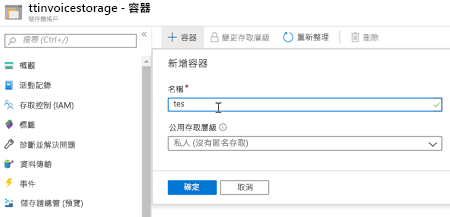
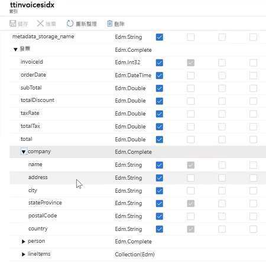
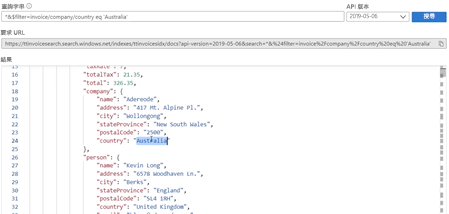

## <a name="demo-4---tying-it-all-together"></a>示範 4 - 全部整合

[](https://globaleventcdn.blob.core.windows.net/assets/aiml/aiml10/videos/Demo4.mp4 "示範 4")

## <a name="summary"></a>摘要
在本練習中，我們會在 Azure 認知搜尋中將所有資源整合在一起來建立索引、技能、資料來源以及索引子，以從我們的 PDF 檔案集合中擷取發票資料。 其中假設了來自先前練習的所有資源和服務都已適當地建立及完成設定。


## <a name="what-you-need"></a>必要條件
- [發票資料集](https://globaleventcdn.blob.core.windows.net/assets/aiml/aiml10/data/invoices_1000.zip) (這是由 1000 張發票組成的較小集合，可用來執行服務及測試功能)


- [Postman](https://www.getpostman.com/) 會用來傳送要求至表單識別器服務 REST API。 若要深入了解，請參閱[簡短的入門](postman.md)。

- Postman [發票搜尋要求集合](src/Collections/Invoice_Search.postman_collection.json)。

## <a name="what-to-do"></a>應採取的動作

有三個主要步驟：
1. 將發票上傳至儲存體帳戶
2. 準備 Azure 認知搜尋索引、技能、資料來源和索引子
3. 監視及使用索引

### <a name="upload-invoice-data"></a>上傳發票資料


1. 在第一個示範中所建立儲存體帳戶內建立稱為 `invoices` 的容器。

[](https://docs.microsoft.com/en-us/azure/storage/blobs/storage-quickstart-blobs-portal?WT.mc_id=msignitethetour2019-github-aiml10 "建立容器")

2. 下載及解壓縮[發票資料集](https://globaleventcdn.blob.core.windows.net/assets/aiml/aiml10/data/invoices_1000.zip)。

3. 將解壓縮後的[發票資料集](https://globaleventcdn.blob.core.windows.net/assets/aiml/aiml10/data/invoices_1000.zip)上傳至 `invoices` 容器。 您可以直接使用[入口網站](https://docs.microsoft.com/en-us/azure/storage/blobs/storage-quickstart-blobs-portal?WT.mc_id=msignitethetour2019-github-aiml10#upload-a-block-blob)或使用 [Azure 儲存體總管](https://docs.microsoft.com/en-us/azure/vs-azure-tools-storage-explorer-blobs?WT.mc_id=msignitethetour2019-github-aiml10)來執行這項操作。

### <a name="prepare-azure-search"></a>準備 Azure 認知搜尋

本節使用 Postman，並假設您了解載入集合、處理變數，以及設定預先要求指令碼。 為了解如何執行這些特定操作，我們已包含一些[指示](postman.md)。

| 名稱                       | 類型                            | 目的                    |
| -------------------------- | ------------------------------- | ------------------------- |
| `api-key`       | 授權         | 存取 Azure 認知搜尋的金鑰  |
| `search_service`       | 變數         | 搜尋服務 URL (不包含通訊協定或斜線)  |
| `index_name`       | 變數         | 所需索引的名稱  |
| `storageConnectionString`       | 變數         | 包含發票的儲存體帳戶連接字串  |
| `cog_svcs_key`       | 變數         | [示範 1](demo1.md) 中所使用的萬用認知服務金鑰  |

1. 將[發票搜尋要求集合](src/Collections/Invoice_Search.postman_collection.json)載入 Postman。

2. 設定所有變數，如上表所述。 其中的每一個值 (`index_name` 除外) 都可以在入口網站的個別服務中找到。 您可以選擇任何想要的 `index_name`。

3. 開啟並執行 `Create Index` 要求 (使用 [Send] \(傳送\) 按鈕)。 這會建立儲存發票資料的索引。 在要求成功完成後，您應該會看到變更反映在入口網站中的 Azure 認知搜尋服務內：



4. 開啟並執行 `Create Skillset` 要求 (使用 [Send] \(傳送\) 按鈕)。 這會建立我們的自訂技能。索引子會使用此技能來擷取發票資料。 此特定技能只有單一技能 (我們的自訂 `InvoiceReaderSkill`)。 如上所述，若要求成功完成，您應該會看到新的技能反映在入口網站中。

5. 開啟並執行 `Create Datasource` 要求 (使用 [Send] \(傳送\) 按鈕)。 這會建立我們儲存體帳戶的參考，該儲存體帳戶中包含了發票。 如上所述，若要求成功完成，您應該會看到新的技能反映在入口網站中。

6. 開啟並執行 `Create Indexer` 要求 (使用 [Send] \(傳送\) 按鈕)。 這會建立索引子，從 `Datasource` 提取發票、在每個發票上使用 `Skillset`，然後將資料儲存在實際的 `Index` 中。 如上所述，若要求成功完成，您應該會看到新的技能反映在入口網站中。


### <a name="monitor-and-use-index"></a>監視及使用索引
索引子將需要一些時間才能逐一查看所有發票文件。 您可以在認知搜尋服務本身內監視這段過程。 您也可以透過查看附加至 Azure 函式對應 App Insights 服務中的即時計量，來監視對 `InvoiceReaderSkill` 的呼叫。 當索引中包含一些文件時，您便可以執行查詢來驗證其是否正常運作：



**一些可以執行的有趣查詢**：

ItemId 為 49 的訂單
```
*&$filter=invoice/lineItems/any(lineItems: lineItems/itemId eq 49)
```

invoiceId 為 12179
```
*&$filter=invoice/invoiceId eq 12179
```

澳洲的公司
```
*&$filter=invoice/company/country eq 'Australia'
```

英國的公司 (包含計數)
```
*&$count=true&$filter=invoice/company/country eq 'United Kingdom'
```

只擷取發票
```
*&$select=invoice&$count=true
```

位於德國的人員
```
*&$count=true&$select=invoice/person&$filter=invoice/person/country eq 'Germany'
```

# <a name="next-demo"></a>下一個示範
繼續前往[示範 5 - 知識存放區](demo5.md)來了解如何探索知識存放區