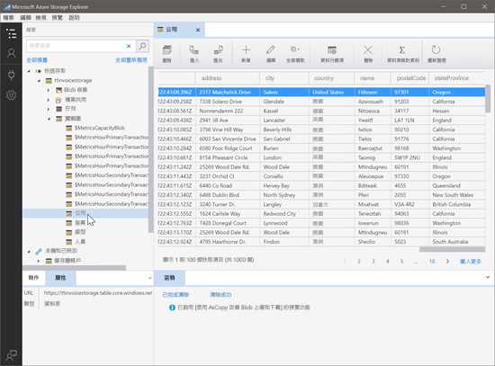

## <a name="demo-5---knowledge-store"></a>示範 5 - 知識存放區

[](https://globaleventcdn.blob.core.windows.net/assets/aiml/aiml10/videos/Demo5.mp4 "示範 5")

## <a name="summary"></a>摘要
在本練習中，我們會探索由[上個練習](demo4.md)中所建立技能集推送到知識存放區的資料。 此投影是先前執行的 `Create Skillset` PUT 要求中，`Skillset` 定義的一部分。 提交至服務的部分如下所示：

```json
"knowledgeStore": { 
  "storageConnectionString": "{{storageConnectionString}}", 
    "projections": [{ 
      "tables": [  
        { "tableName": "Invoices", "generatedKeyName": "InvoiceRef", "source": "/document/invoice" , "sourceContext": null, "inputs": []}, 
        { "tableName": "Company", "generatedKeyName": "CompanyRef", "source": "/document/invoice/company", "sourceContext": null, "inputs": []}, 
        { "tableName": "People", "generatedKeyName": "PersonRef", "source": "/document/invoice/person", "sourceContext": null, "inputs": []}, 
        { "tableName": "LineItems", "generatedKeyName": "LinteItemRef", "source": "/document/invoice/lineItems/*" ,"sourceContext": null, "inputs": []} 
      ]  
    }]
}
```
這使用 `storageConnectionString` 作為投影的目標。 在此情況下，它會使用屬於儲存體服務的 Azure 儲存體資料表來儲存資料。

## <a name="what-to-do"></a>應採取的動作
唯一剩下要做的事，就是探索索引子如何使用技能集將資料投影到知識存放區。 這可以使用 Microsoft [Azure 儲存體總管](https://docs.microsoft.com/en-us/azure/vs-azure-tools-storage-explorer-blobs?WT.mc_id=msignitethetour2019-github-aiml10)來完成：


