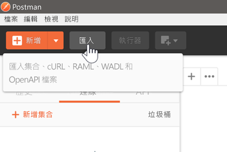
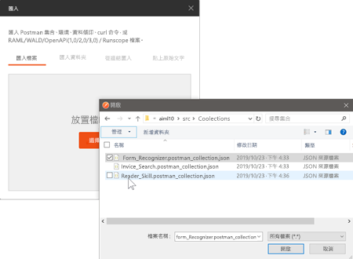
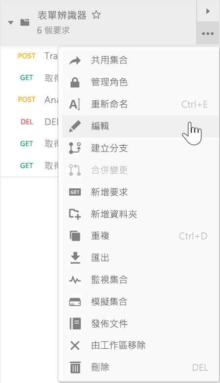
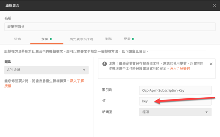
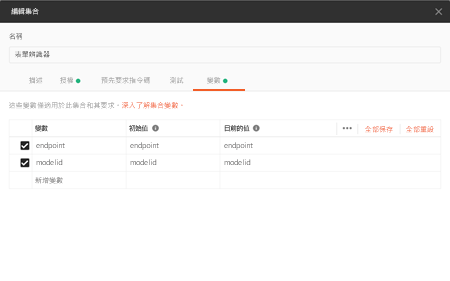
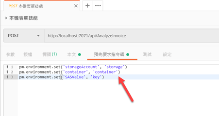

# 使用 Postman
若要在所有示範中進行練習，有三個必要概念：

1. 匯入集合
2. 設定集合變數
3. 使用預先要求指令碼來設定變數

## 必要條件
整個示範中使用了三個集合：
1. [表單辨識器 API 呼叫](src/Collections/Form_Recognizer.postman_collection.json)
2. [讀者技能 API 呼叫](src/Collections/Reader_Skill.postman_collection.json)
3. [發票搜尋 API 呼叫](src/Collections/Invoice_Search.postman_collection.json)

## 匯入集合

1. 下載適當的集合 (請參閱以上所述)。
2. 開啟 Postman
3. 按一下 [Import] \(匯入\)

4. 選取適當的集合

## 修改集合變數

集合變數可讓 Postman 將 `{variable}` 等權杖取代為使用者設定的值。 這可以讓要求的可攜性更佳，並可以對變數進行變更。 例如，有些練習中的 `endpoint` 變數代表特定表單辨識器服務端點。 

1. 在載入集合後，按一下省略符號來編輯集合變數

2. 若要編輯授權變數，請使用 [authorization] \(授權\) 索引標籤。

3. 這些練習中所使用的所有其他變數都可以在 [variables] \(變數\) 索引標籤下找到

## 使用預先要求指令碼

有些練習需要對預先要求指令碼進行變更。 這些指令碼可以在個別要求的 [Pre-request Script] \(預先要求指令碼\) 中存取，如下所示。

