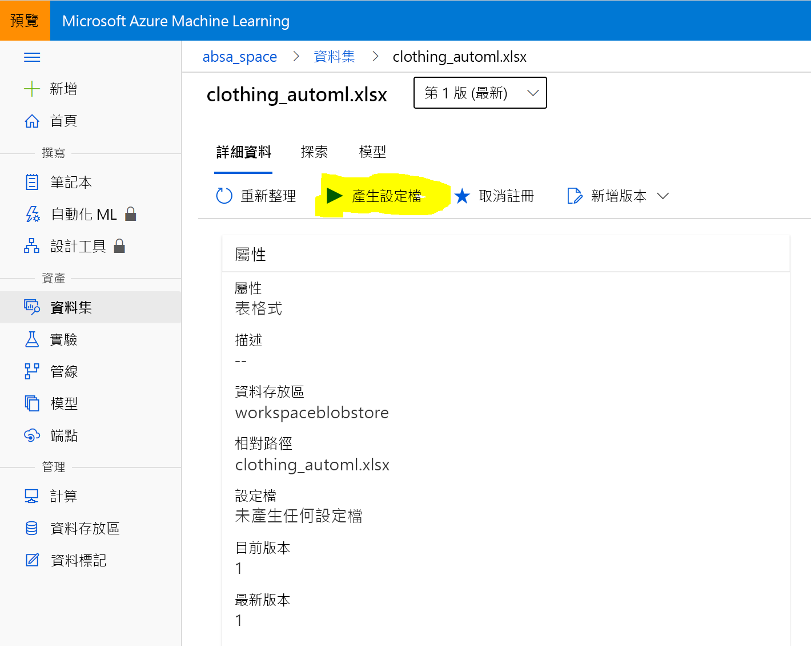

# <a name="aiml40---taking-models-to-the-next-level-with-azure-machine-learning-best-practices"></a>AIML40 - 使用 Azure Machine Learning 的最佳做法讓模型更上一層樓

## <a name="session-information"></a>工作階段資訊

人工智慧和機器學習可用於許多方式來提高商務程序的生產力，並藉由分析非結構化資料流程內的影像、文字和趨勢來收集有意義的見解。 雖然許多工作都可以用現有模型來解決，但在某些情況下，您也需要定型自己的模型，以運用於更具體的工作或提高準確度。 

在此課程中，我們會探索將文字分析智慧型服務整合至 [Tailwind Traders](http://tailwindtraders.com) 商務程序的完整過程，從可用為[認知服務](https://azure.microsoft.com/services/cognitive-services/?WT.mc_id=msignitethetour2019-github-aiml40)的預先建置模型開始，一直到訓練[以外觀為基礎之情感分析](https://www.intel.ai/introducing-aspect-based-sentiment-analysis-in-nlp-architect/)的協力廠商神經自訂模型，此模型使用 [Azure Machine Learning 服務](https://azure.microsoft.com/services/machine-learning-service/?wt.mc_id=msignitethetour2019-github-aiml40) 作為 [Intel NLP Architect](http://nlp_architect.nervanasys.com/) 的一部分提供。 我們將討論需要自訂模型的案例，並示範使用 [AutoML](https://docs.microsoft.com/azure/machine-learning/service/concept-automated-ml/?wt.mc_id=msignitethetour2019-github-aiml40) 從頭開始建立這類模型的快速方法，也會示範如何使用 [HyperDrive](https://docs.microsoft.com/azure/machine-learning/service/how-to-tune-hyperparameters/?wt.mc_id=msignitethetour2019-github-aiml40) 來微調模型超參數

## <a name="table-of-content"></a>目錄
 

| 資源          | 連結                            |
|-------------------|----------------------------------|
| PowerPoint        | - [簡報](presentations.md) |
| 影片            | - [嘗試執行排練](https://youtu.be/If9IQm3gWVQ) <br/>- [Microsoft Ignite 奧蘭多錄影](https://myignite.techcommunity.microsoft.com/sessions/83002?source=sessions) |
| 示範             | - [Demo 1 - Cognitive Services Text Analytics](https://github.com/microsoft/ignite-learning-paths-training-aiml/tree/master/aiml40#demo-1-text-analytics-cognitive-service) (示範 1 - 認知服務文字分析) <br/>- [Demo 2 - Automated Machine Learning](https://github.com/microsoft/ignite-learning-paths-training-aiml/tree/master/aiml40#demo-2-azure-automl) (示範 2 - 自動化機器學習) <br/>- [Demo 3 - Azure Machine Learning SDK and Hyperdrive](https://github.com/microsoft/ignite-learning-paths-training-aiml/tree/master/aiml40#demo-3-using-azure-ml-workspace-with-python-sdk) (示範 3 - Azure Machine Learning SDK 和 Hyperdrive) |

## <a name="delivery-assets"></a>傳遞資產

* [PowerPoint 簡報](https://github.com/microsoft/ignite-learning-paths-training-aiml/blob/master/aiml40/presentations.md)
* [其他簡報者資源](README-Instructor.md)
* 示範影片：
    * Demo 1 - [Cognitive Services Text Analytics](https://youtu.be/QJxjm5BirOA) (示範 1 - 認知服務文字分析)
    * 示範 2 - [Automated Machine Learning](https://youtu.be/qrstXN6TLZk) (自動化機器學習)
    * Demo 3 - [Azure Machine Learning SDK and Hyperdrive](https://youtu.be/sccNTPO3PwU) (示範 3 - Azure Machine Learning SDK 和 Hyperdrive)


## <a name="overview-of-demonstrations"></a>示範的概觀

此簡報會進行下列示範：

1. 使用[認知服務文字分析](https://azure.microsoft.com/services/cognitive-services/text-analytics/?wt.mc_id=msignitethetour2019-github-aiml40)來找出服裝評論的情感
2. 使用 [Azure 自動化 ML](https://docs.microsoft.com/azure/machine-learning/concept-automated-ml?wt.mc_id=msignitethetour2019-github-aiml40) 來建立文字分類器，幾乎不需要程式碼
3. 使用 [Azure Machine Learning 服務](https://azure.microsoft.com/services/machine-learning-service/?wt.mc_id=msignitethetour2019-github-aiml40)來定型以外觀為基礎的情感分析模型。

## <a name="starting-fast"></a>快速開始

如果想要立即開始，您可以透過 Azure 範本來部署所有必要的資源。 

<a href="https://portal.azure.com/#create/Microsoft.Template/uri/https%3A%2F%2Fraw.githubusercontent.com%2Fmicrosoft%2Fignite-learning-paths-training-aiml%2Fmaster%2Faiml40%2Ftemplate%2Fazuredeploy.json" target="_blank">
 
</a>

下面，我們會提供更詳細的示範指示來供您手動執行這些步驟，以完全了解所示範的概念。

## <a name="initial-environment-setup"></a>初始環境設定

為了執行示範的步驟 2 和 3，我們必須：

1. 建立 Azure Machine Learning 工作區
2. 上傳用於 AutoML 定型的資料 - [clothing_automl.xlsx](https://github.com/microsoft/ignite-learning-paths-training-aiml/blob/master/aiml40/dataset/clothing_automl.xlsx)

#### <a name="creating-azure-machine-learning-workspace"></a>建立 Azure Machine Learning 工作區

建立 Azure ML 工作區的方式如下：
* 從 [Azure 入口網站](http://portal.azure.com/?wt.mc_id=msignitethetour2019-github-aiml40)手動建立 ([這裡提供完整的逐步解說](https://docs.microsoft.com/azure/machine-learning/service/how-to-manage-workspace/?wt.mc_id=msignitethetour2019-github-aiml40))
* 從提供的 Azure 範本部署
* 使用下列命令，透過 [Azure CLI](https://docs.microsoft.com/cli/azure/?view=azure-cli-latest&wt.mc_id=msignitethetour2019-github-aiml40) 建立：

```shell
az extension add -n azure-cli-ml
az group create -n absa -l westus2
az ml workspace create -w absa_space -g absa
```

> 💡 *重要事項：我們使用 `absa_space` 作為工作區名稱，並使用 `absa` 作為 Azure 資源群組名稱。在準備和示範期間，我們會多次參考那些名稱，因此最好不要加以變更。不過，如果您變更這些名稱，就必須注意並據以調整一些命令。此外，我們也會使用「美國西部 2」  作為資料中心位置 -- 您可以根據將進行示範的區域加以調整。*

您也需要知道訂用帳戶識別碼，其可透過執行 `az account list` 來取得。

#### <a name="uploading-data-to-the-workspace"></a>將資料上傳至工作區

在示範中，我們會使用一些資料集：
* 用於自動化 ML 示範的資料集 - [clothing_automl.xlsx](https://github.com/microsoft/ignite-learning-paths-training-aiml/blob/master/aiml40/dataset/clothing_automl.xlsx)
* 大型資料集 [clothing_absa_train.csv](https://github.com/microsoft/ignite-learning-paths-training-aiml/blob/master/aiml40/dataset/clothing_absa_train.csv)，用於示範 3 定型以外觀為基礎的完整情感分析模型
* 較小型的偵錯資料集 [clothing_absa_train_small.csv](https://github.com/microsoft/ignite-learning-paths-training-aiml/blob/master/aiml40/dataset/clothing_absa_train_small.csv)，用於以外觀為基礎的情感分析模型
* 個別的驗證集 [clothing-absa-validation.json](https://github.com/microsoft/ignite-learning-paths-training-aiml/blob/master/aiml40/dataset/clothing-absa-validation.json)，用於測試模型

若要遵循自動化 ML 示範，請將資料集上傳至您的工作區：
 * 移至 [Azure ML 入口網站](http://ml.azure.com/?wt.mc_id=msignitethetour2019-github-aiml40)
 * 選取 [資料集]  索引標籤 -> [建立資料集]   -> [從本機檔案] 
 * 指定 *Clothing_AutoML* 作為資料集名稱
 * 維持 [表格式]  作為資料集類型，然後按一下 [下一步] 
 * 維持預設儲存體名稱，然後按一下 [瀏覽]  以從此存放庫選取 `clothing_automl.xlsx` 檔案
 * 按一下 [下一步]  以上傳檔案
 * 您在上傳檔案時可能會遇到錯誤，顯示 [CORS 錯誤:  無法設定 CORS 規則]，[查看螢幕擷取畫面](images/dataset_upload_error.png)。 如果發生此情況，請按一下連結 [CORS 設定]  ，在 CORS 設定頁面的 [Blob 儲存體]  下，選取第一行中的 [允許的方法]  ，然後除了 [GET]  和 [HEAD]  之外，選取 [PUT]  和 [POST]  \(查看[螢幕擷取畫面](images/dataset_upload_error_cors.png)\)。 按一下 [儲存]  ，然後重複資料集上傳程序。
 * 按兩次 [下一步]  ，在最後一個頁面上選取 [建立後分析資料集]  ，然後按一下 [建立]  。  

自動化 ML 服裝資料集可透過示範程式碼上傳至 AML 服務資料存放區。

此外，為了使用自動化 ML 功能，您必須將工作區轉換為 *Enterprise* 等級。 按一下 [自動化 ML]  索引標籤，然後選擇升級工作區的選項以完成轉換。 此作業只需要幾秒。

#### <a name="using-the-azure-ml-demo-code"></a>使用 Azure ML 示範程式碼

您可以從任何 Jupyter Notebook 環境執行示範程式碼。 我們建議使用 Azure ML 服務內建的 Jupyter Notebook，因為它需要的安裝步驟較少。 [個別的筆記本設定文件](notebook-setup.md)中有使用其他選項的指示。

若要從 Azure ML 工作區內使用 Jupyter Notebook：
    - 瀏覽至 [Azure ML 入口網站](https://ml.azure.com/)
    - 從左側功能表選取 [筆記本] 
    - 上傳 `absa.ipynb` 檔案 (按一下有箭號的按鈕)，然後在檔案窗格中加以選取
    - 為了能夠執行筆記本，請從筆記本頂端功能表選取 [+ 新增 VM]  ，然後建立新的筆記本 VM。
    - 現在，您可以直接從入口網站使用筆記本
    - 若要在全螢幕瀏覽器中開啟 Jupyter Notebook (不是在 ML 入口網站中開啟)，請在頂端功能表中選取 [Jupyter]   -> [在 Jupyter 中開啟]  \(取決於螢幕解析度，該選項可能隱藏在 `...` 按鈕底下\)

若要從 `absa.ipynb` 中的 Python 程式碼連線到您的工作區，您必須提供工作區資料。 您可以執行以下任一動作：
 * 將您的訂用帳戶識別碼插入 `absa.ipynb` 的程式碼中，並將下列程式碼取消註解：
```python
subscription_id = 'd04ba089-....'
resource_group  = 'absa'
workspace_name  = 'absa_space'
ws = Workspace(subscription_id = subscription_id, resource_group = resource_group, workspace_name = workspace_name)
ws.write_config()
```
 * 或者，您可以透過 Azure 入口網站下載 `config.json` 檔案，並將其上傳到與 `absa.ipynb` 相同的資料夾，在此情況下，命令 `ws = Workspace.from_config()` 會載入此資料並自動連線到工作區。

> 💡 **注意**：`absa.ipynb` 檔案中的某些程式碼需要**很長的時間**來執行。 為了向聽眾示範，您必須事先預先執行某些資料格，然後只執行部分資料格來顯示結果。 有另一個名為 `absa-instructions.ipynb` 的檔案包含相同程式碼，但有額外的註解，指出哪些資料格必須在示範期間執行，而哪些資料格必須略過。 請在準備期間參閱此檔案，而且務必在實際示範之前，先執行 `absa.ipynb` 中的資料格。

#### <a name="pre-creating-compute-cluster"></a>預先建立計算叢集

您需要計算叢集以用於最後兩個示範。 針對示範用途，我們將建立僅由單一節點組成的叢集。 完成此步驟的方式有兩種：

* **建議**：透過 [Azure ML 入口網站](http://ml.azure.com/?wt.mc_id=msignitethetour2019-github-aiml40)前往 [計算]  區段，並使用 *Standard_DS3_v2* VM 來手動建立 Azure ML Compute 叢集，指定節點數目 = 1。 將叢集命名為 `absa-cluster`。 
* 執行 `absa.ipynb` 筆記本中的前幾個資料格，系統將會為您建立叢集。

#### <a name="generate-dataset-profile"></a>產生資料集設定檔

若要顯示 AutoML 示範，您必須為 `clothing_automl.xlsx` 資料集「產生設定檔」  。 這是耗時的作業，應該在示範之前完成。 最簡單方式是透過入口網站來執行：

1. 移至 [Azure ML 入口網站](https://ml.azure.com)
2. 選取 [資料集]  -> [Clothing_automl.xlsx]
3. 選擇 [產生設定檔]  按鈕 
4. 選取計算 -- 您可以使用您在上一步建立的叢集
5. 系統將會排程設定檔產生工作
6. 您可以在 Azure ML 入口網站上的 [實驗]  索引標籤中監視工作。 

## <a name="demos"></a>示範

### <a name="demo-1-text-analytics-cognitive-service"></a>示範 1：文字分析認知服務

> 💡 您必須先完成[環境設定](https://github.com/microsoft/ignite-learning-paths-training-aiml/tree/master/aiml40#starting-fast)，才能嘗試進行此示範。

在此示範中，我們將示範文字分析如何在 Web 介面中執行片語的情感分析。

1. 開啟[文字分析頁面](https://azure.microsoft.com/services/cognitive-services/text-analytics/?WT.mc_id=msignitethetour2019-github-aiml40)
2. 向下捲動至 [以動作檢視]  區段，並輸入片語 *I loved the polka dot pants that I bought in the london store* (您也可以保留預設片語來示範該要點)。
3. 按下 [分析]  以取得下列結果：


請注意，文字分析不只提供情感，也會從文字擷取位置和關鍵字。

### <a name="demo-2-azure-automl"></a>示範 2：Azure AutoML

> 💡 您必須先完成[環境設定](https://github.com/microsoft/ignite-learning-paths-training-aiml/tree/master/aiml40#starting-fast)，才能嘗試進行此示範。

在此示範中，我們將示範在不需撰寫程式碼的情況下如何使用自動化 ML 來建立 ML 模型。

1. 在 [http://ml.azure.com](http://ml.azure.com/?WT.mc_id=msignitethetour2019-github-aiml40) 中巡覽至 Azure ML 工作區 (已在上面建立)
2. 前往**資料集** - 您應該會在該處看到先前上傳的資料集 (clothing_automl.xlsx)。 請提及使用者也可以在這裡透過入口網站加以上傳。
3. 選取資料集。
4. 您將會看到 [詳細資料]  索引標籤。請提及 [範例使用方式]  方塊，並展示可用來以程式設計方式存取資料的程式碼 (如有需要)。
5. 從 [探索]  索引標籤查看資料。 您可以選擇性地選取 [設定檔]  索引標籤，以查看更詳細的資料相關統計資料。
6. 移至 [自動化 ML]  索引標籤，然後按一下 [新增自動化 ML 回合] 
7. 在資料集選取頁面上，選取 [Clothing_AutoML]  資料集，然後按一下 [下一步] 
8. 選擇實驗名稱 (例如 `AutoML`)，[評等]  為目標資料行，然後選取要使用的計算 (使用我們已建立的叢集)。
9. 選擇預測工作的類型 -- [分類]  。 您可以選擇性地**啟用深度學習**
10. 現在您可以按一下 [開始]  。

由於實驗將會調查不同的演算法，因此執行時間會很長。 如果要用於示範用途，請事先執行此操作，並僅顯示結果。 若要顯示結果，請移至 [Azure ML 入口網站](http://ml.azure.com)中的 [實驗]  索引標籤，然後選取您已執行的實驗。

### <a name="demo-3-using-azure-ml-workspace-with-python-sdk"></a>示範 3：搭配 Python SDK 使用 Azure ML 工作區

> 💡 您必須先完成[環境設定](https://github.com/microsoft/ignite-learning-paths-training-aiml/tree/master/aiml40#starting-fast)，才能嘗試進行此示範。

我們將在此示範中執行自訂 Python 程式碼，該程式碼會使用 Python Azure ML SDK 來定型、最佳化及使用自訂以外觀為基礎的情感分析 (ABSA) 模型。

此部分示範的所有指示都位於 Jupyter Notebook 本身中。 使用上述其中一項方法來執行 Notebook (在 Azure Notebooks 中或在本機執行)，並遵循該處的指示。 

## <a name="tear-down"></a>終止方法

若要釋放在示範期間所使用的雲端資源，您必須刪除 Azure ML 工作區和資源群組：

```shell
az ml workspace delete --w absa_space -g absa
az group delete -n absa
```

## <a name="presenter-resources"></a>其他簡報者資源

如果您要簡報此內容，請查看[其他簡報者資源](README-Instructor.md)。

## <a name="resources-and-continue-learning"></a>資源與繼續學習

### <a name="getting-started-series"></a>快速入門系列

* [Azure 認知服務文字分析 API](https://aka.ms/TextCogSvc)
* [自動化機器學習](https://aka.ms/AutomatedMLDoc)
* [超參數微調](https://aka.ms/AzureMLHyperDrive)
* [Azure ML 服務和 Python SDK](https://aka.ms/AA3dzht) 

### <a name="other-materials"></a>其他材料

* [9 種用於生產機器學習的進階提示](http://aka.ms/9TipsProdML)
* [Intel 以外觀為基礎的情感分析頁面](https://www.intel.ai/introducing-aspect-based-sentiment-analysis-in-nlp-architect/)
* Azure ML 最佳做法存放庫：
    * [自然語言處理](https://github.com/microsoft/nlp/)
    * [電腦視覺](https://github.com/microsoft/ComputerVision)
    * [推薦](https://github.com/microsoft/Recommenders)


## <a name="feedback-loop"></a>意見反應迴圈

您是否有註解、意見反應或建議？ 目前，內容變更/建議/意見反應的最佳意見反應迴圈，是在此 GitHub 存放庫上建立新的問題。 若要取得如何建立問題的所有詳細資料，請參閱[參與](../../contributing.md)文件
